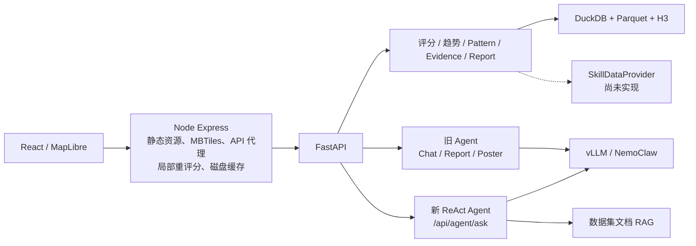
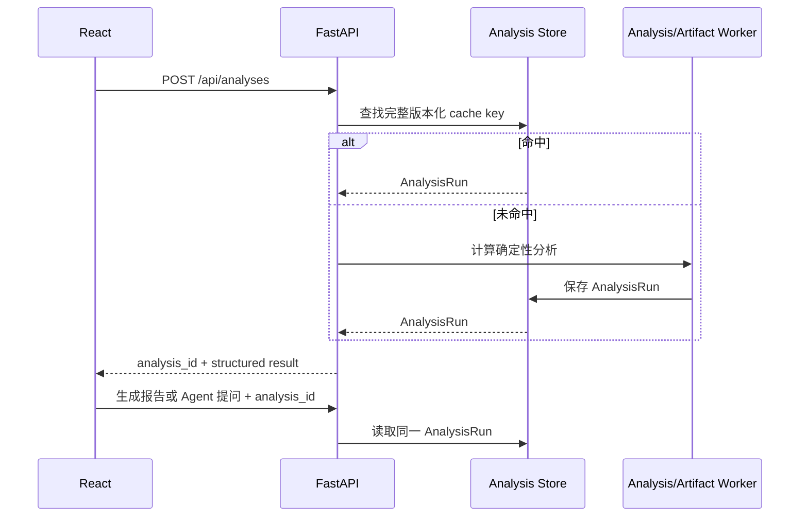

# Urban Dossier 延续开发计划

> 文档状态：Execution in progress  
> 基线日期：2026-07-31；工作站实测更新：2026-08-02  
> 审查方式：静态框架审查 + x86 NVIDIA 工作站部署与端到端实测  
> 适用阶段：从 Hackathon Demo 演进为可解释、可复现、可持续扩展的本地城市分析产品

## 1. 执行摘要

Urban Dossier 的核心技术路线可以继续使用，不需要重写，也不应立即拆成微服务。现阶段的主要问题不是缺少 DGX Spark，而是系统在从 Demo 向产品演进时形成了多套并行实现：两套 Agent、前后端重复的评分解释、缺乏版本信息的缓存、未完成的数据 Provider，以及文档能力与实际接口之间的差异。

下一阶段采用“模块化单体收口”策略：

1. 先修复确定性正确性和接口断裂。
2. 让 FastAPI 成为唯一业务事实来源。
3. 建立可复现的 `DatasetSnapshot -> AnalysisRun -> Artifact` 链路。
4. 统一 Agent、会话、工具和 Evidence 契约。
5. 在稳定内核上扩展 Compare、时间探索、Watchlist、数据接入和导出。
6. 最后实现 Isochrone、Similarity 和有明确假设的 Simulation。

推荐平台策略：

- Mac：主要开发环境和 CPU reference implementation。
- x86 NVIDIA Linux：主要生产环境和 CUDA 加速实现。
- Jetson Orin AGX：未来可选的轻模型边缘 profile，不作为当前完整生产主机。

## 2. 当前框架评估

### 2.1 当前调用链



### 2.2 应继续保留

- React + MapLibre：适合作为本地优先空间产品的交互层。
- FastAPI + Pydantic：适合作为统一 API、应用服务和契约层。
- DuckDB + Parquet + H3：继续作为单机空间分析底座。
- CPU/GPU fallback：保留思路，但改造成显式 Adapter，而不是散落的条件导入。
- 确定性分析优先于 LLM：分数、趋势和证据必须由分析引擎计算。
- Evidence 与 schema version：保留并升级为完整 provenance 和 methodology contract。
- FAISS/cuVS 双路径：保留为 Mac 与 CUDA 环境下的不同实现。

### 2.3 主要架构债务

| 领域 | 当前问题 | 影响 |
| --- | --- | --- |
| Agent | 旧 `/chat` 与新 `/ask` 并存，新链路未接入 Node/UI | 行为不一致，新增工具无法进入产品 |
| 业务事实 | Node、FastAPI、前端均参与解释或缓存分析结果 | 同一位置可能出现不同视觉与报告语义 |
| 数据契约 | 响应包含大量动态 dict/`Record<string, unknown>` | 前后端漂移无法在编译期发现 |
| 可复现性 | 缺少 snapshot、methodology、prompt/model version | 缓存和报告无法追溯 |
| 数据接入 | `SkillDataProvider` 仍为占位实现 | “任意 CSV 自动接入”尚不是完整能力 |
| 并发 | 请求内嵌套线程池与多个 DuckDB 连接 | 资源上限和失败模式不清晰 |
| 测试 | CI 主要做语法和 catalog 检查 | 接口签名、前端构建、评分回归未被保护 |
| 部署 | 依赖清单分散，README 含未落地步骤 | clean clone 难以形成可验证路径 |

## 3. 产品与工程目标

### 3.1 目标

- 任意一个用户可见分数都能解释其原始值、单位、归一化方法、数据覆盖和证据来源。
- 同一 `analysis_id` 在不同入口中复用，不因生成报告或 Agent 对话重复执行完整分析。
- Mac 与 x86 Linux 使用同一业务代码，只切换运行时 Adapter。
- 在没有完整 NYC 数据和模型的测试环境中，也能通过 fixture 验证核心路径。
- Compare、Watchlist、时间变化和 Agent 都消费同一个分析契约。
- 报告、JSON 和其他 artifact 可追溯到数据 snapshot 与方法版本。

### 3.2 非目标

- 暂不拆微服务或引入 Kubernetes。
- 暂不把所有在线查询改写为 cuDF。
- 暂不将数百万原始数据行逐条向量化。
- 暂不建设多租户组织、复杂 RBAC 或云原生控制面。
- 暂不提供没有因果假设和不确定性说明的“AI 预测”。
- 暂不维护 Jetson 专属业务分支。

## 4. P0：正确性与接口修复

### P0-01 统一并修复 Agent 入口

当前已确认：

- [`app.py`](backend/src/urban_dossier_backend/app.py) 使用 `message` 和 `session_id` 调用 `run_agent()`。
- [`agent_loop.py`](skills/urban_dossier_analyst/agent_loop.py) 实际接收 `user_message`，且没有 `session_id` 参数。
- `AskResponse.tools_called` 声明为 `list[dict]`，Agent 实际返回 `list[str]`。
- 新建 `/api/agent/ask` session 后，首轮对话没有写回 session。
- [`server.js`](server.js) 没有代理 `/api/agent/ask`。
- [`AgentChat.tsx`](interactive-map-explorer/src/components/AgentChat.tsx) 仍调用 `/api/agent/chat`，并且没有使用传入的 `analysisPayload`。

交付物：

- 一个正式入口：`POST /api/agent/ask`。
- 一个 `AgentRequest`、一个 `AgentResponse`、一个 session history 契约。
- Node 代理和前端调用统一接入新入口。
- Report、Poster、Refine 变为 Agent artifact/tool，不再维护平行编排器。
- 未实现工具不向模型暴露。

验收标准：

- 无 session 的首轮问题返回 session id，并能在第二轮读取第一轮历史。
- `tools_called`、`trace`、`evidence` 通过 Pydantic 和前端生成类型验证。
- Agent 无需重新生成 location analysis，能使用已有 `analysis_id`。
- API contract test 能捕获参数名或响应类型漂移。

### P0-02 修复评分语义

当前已确认：

- `311_sanitation` 严重度使用了 rodent baseline。
- `collision` 在类别配置中属于 Safety，但当前状态放入 Transit。
- fallback Transit 分数几乎只反映交通事故，不反映真正的公共交通/可达性。
- Building 生成分数和行动建议，但整体权重为 0，也不能作为用户优先级。
- `include_report` 在请求模型中存在，但 API 未传递给 `analyze_point()`。

交付物：

- `MetricDefinition` 注册表，明确 metric id、分类、单位、方向、空间粒度、时间粒度和 normalization。
- Safety、Mobility/Transit、Amenities、Building 的正式产品定义。
- Building 选择其一：正式第四维度，或独立 Risk Flag。
- `include_report=false` 确实跳过 LLM 报告生成。
- 针对 baseline、权重、缺失数据、zero/null 的回归测试。

验收标准：

- 评分测试包含固定输入与期望输出 golden cases。
- UI、报告和 Agent 对同一 metric 使用同一名称、分类和方向。
- 缺失数据不会被静默解释为 0。

### P0-03 修复趋势与 Pattern 时间对齐

当前季度标签按执行当天倒推，相关序列按数组右端对齐，而不是按真实季度 key 对齐。

交付物：

- 季度序列结构改为 `{period, value, coverage}`。
- 所有相关性按 period inner join 或明确的 missing-data policy 对齐。
- anomaly、correlation、persistence 带最小样本数和方法说明。
- UI 将 heuristic 标记为“信号”而不是统计或因果结论。

验收标准：

- 缺失中间季度时，不会将不同季度的数据相互配对。
- 报告显示真实数据周期，而不是当前日期推导周期。
- 样本不足时返回 `insufficient_data` 和原因。

### P0-04 建立最低可运行基线

交付物：

- 一个小型匿名 fixture 数据集。
- 一条不依赖完整 NYC 数据、NemoClaw 或 GPU 的验证路径。
- 修正文档中不存在或尚未实现的脚本/profile。
- health/coverage 明确区分：服务可用、Provider 可用、数据集可用、overview 可用、模型可用。

验收标准：

- clean clone 可通过单条 bootstrap 命令安装开发依赖。
- test profile 可完成 health、overview、preview、analysis、Agent stub contract 测试。
- 没有数据集时不得报告 `provider_ready=true`。

## 5. 目标框架

### 5.1 模块化单体目录

```text
backend/src/urban_dossier/
  api/                  # HTTP、认证、请求/响应序列化
  application/          # AnalyzeLocation、Compare、Watchlist、AskAgent
  domain/               # 核心模型与纯业务规则
  ports/                # LLM、Embedding、VectorIndex、GeoStore、SessionStore
  adapters/
    duckdb/
    sqlite/
    mac/
    cuda/
  jobs/                 # ingest、overview、baseline、RAG index、export
```

先在现有 backend 中渐进迁移，不做大爆炸式改目录。

### 5.2 分层职责

| 层 | 职责 | 禁止事项 |
| --- | --- | --- |
| React | 交互、展示、用户工作区 | 不计算业务分数 |
| Node | 静态资源、MBTiles/vector tile、反向代理 | 不重排分数，不缓存业务报告 |
| FastAPI API | 认证、契约、状态码 | 不直接写复杂查询和评分公式 |
| Application | 编排 use case、事务、cache/job | 不绑定 CUDA 或具体模型 |
| Domain | 评分、Evidence、版本和规则 | 不访问文件、网络或数据库 |
| Adapter | DuckDB、模型、向量库、session 持久化 | 不定义产品评分语义 |
| Worker | 重计算、导入、索引、报告导出 | 不阻塞在线请求线程 |

### 5.3 核心领域契约

#### DatasetSnapshot

```text
dataset_id
snapshot_id
source_url
ingested_at
source_updated_at
schema_version
content_hash
spatial_grain
temporal_grain
license
quality_summary
```

#### MetricDefinition

```text
metric_id
label
category
unit
directionality
normalization_method
spatial_grain
temporal_grain
minimum_coverage
methodology_version
```

#### ScoreCard

```text
metric_id
raw_value
normalized_score
percentile
coverage
confidence
methodology_version
evidence_ids
```

#### EvidenceRef

```text
evidence_id
dataset_id
snapshot_id
query_or_transform_id
spatial_scope
temporal_scope
summary
```

#### AnalysisRun

```text
analysis_id
request_parameters
dataset_snapshot_ids
methodology_version
computed_at
structured_result
artifact_ids
```

### 5.4 AnalysisRun 与缓存

新的主链路：



cache key 至少包括：

- canonical location/H3 cell；
- radius；
- time window；
- priority profile；
- dataset snapshot ids；
- methodology version；
- schema version；
- artifact 类型对应的 model 与 prompt version。

短期使用 SQLite 或 diskcache 管理单机 cache metadata；只有在多 worker、多主机部署后再引入 Redis。

## 6. Runtime Profile 与平台策略

### 6.1 统一能力接口

定义：

- `AnalyticsAdapter`
- `LLMAdapter`
- `EmbeddingAdapter`
- `VectorIndexAdapter`
- `SessionStore`
- `ArtifactStore`

业务代码只能依赖这些接口和 capability flags。

### 6.2 Profile 矩阵

| Profile | 分析 | LLM | Embedding/Vector | 用途 |
| --- | --- | --- | --- | --- |
| `test` | fixture + DuckDB | stub | in-memory/FAISS fixture | CI 与契约验证 |
| `mac` | DuckDB/Parquet/H3 | MLX 或 llama.cpp 的 OpenAI-compatible endpoint | CPU embedding + FAISS | 主开发环境 |
| `cuda-x86` | DuckDB 在线查询；cuDF/cuML 用于适合的批处理 | vLLM | cuVS 或 FAISS | 主生产环境 |
| `dgx-spark` | DuckDB reference；RAPIDS 仅在 GB10 实测胜出后启用 | DGX-specific vLLM | 当前小语料 CPU exact/FAISS；大语料再评估 cuVS | 独立 ARM64/统一内存部署方案 |
| `jetson-edge` | 预计算结果/轻量查询 | 小模型或远端兼容 endpoint | FAISS/轻量 index | 后续可选边缘部署 |

平台验收原则：相同 fixture、snapshot 和 methodology 下，Mac、x86 Linux
与 DGX Spark 的确定性结果应完全一致或在声明的浮点容差内一致。

## 7. 数据与任务框架

### 7.1 在线请求与离线任务分离

在线请求：

- 搜索地址；
- 获取 overview tile/cell；
- 读取已预计算或轻量分析结果；
- 读取 AnalysisRun；
- Agent 对已有 AnalysisRun 提问。

后台任务：

- 数据下载与 schema validation；
- H3/NTA 聚合；
- baseline 与 percentile；
- RAG index；
- 大型 Watchlist refresh；
- HTML/PDF artifact；
- 全城 anomaly/change detection。

短期建议使用 SQLite job table + 单 worker，或轻量任务框架；不急于引入 Celery。重任务不应依赖 FastAPI 进程内 `BackgroundTasks`。参考 [FastAPI Background Tasks](https://fastapi.tiangolo.com/tutorial/background-tasks/)。

### 7.2 DuckDB 使用约束

- 每个 worker/request 使用受控连接上下文。
- 避免 application 层和 provider 层各自创建线程池。
- 配置统一的并发、内存和 query timeout。
- 将大聚合转为 snapshot 构建任务。
- 多进程写入需求出现前，继续使用 DuckDB/Parquet；不要过早迁移分析表到 PostgreSQL。

参考：[DuckDB Concurrency](https://duckdb.org/docs/current/connect/concurrency)。

### 7.3 控制面存储

单机阶段增加 SQLite，用于：

- dataset manifests 与 snapshots；
- analysis runs；
- sessions；
- saved places/watchlists；
- jobs 与 artifact metadata。

Parquet 继续保存大规模事实和聚合数据。未来只有在出现多用户并发写、远程协作或多实例部署时，再将控制面迁移到 PostgreSQL/PostGIS。

### 7.4 工作站数据基线与 CUDA-X 边界（2026-08-02）

当前工作站快照已经完成严格全文件审计：18/18 个 raw CSV 可解析，合计
82,376,420 行、33.58 GB；发布层为 44 个 ZSTD Parquet 文件，合计约
290 MB。发布规则为 250,000 行 row group、dictionary encoding、row-group
statistics 和原子 `.part` 替换。审计结果保存在第二块 SSD 的
`datasets/manifests/raw-audit.json` 与 `ready-audit.json`。

正式数据分层：

1. Bronze：不可变源 CSV、下载元数据、hash/schema/row-count manifest；坏导出只进入 quarantine。
2. Silver：规范类型、业务状态过滤、NYC bbox、H3/ZIP key 的 indexed Parquet。
3. Gold：H3/ZIP score、quarterly trend、baseline 和 overview cell/tile。
4. Serving：DuckDB 查询 Gold，按需下钻 Silver；Agent 只接收有来源的紧凑 evidence，不读取全量事实行。

Parquet 是 CPU/GPU 之间的主分析交换格式，但不是 Agent memory。Agent 的
语义层仍需要 catalog、字段含义、snapshot id、受控 SQL/template 和 evidence
provenance；文档/方法说明可以单独建立小型向量索引，禁止逐行 embedding
事实表。

工作站已用官方 `nvcr.io/nvidia/rapidsai/base:26.06-cuda13-py3.12`
验证 cuDF 能读取并聚合本项目 ZSTD Parquet。当前 20–80 MB 常用文件的热
缓存聚合，DuckDB 实测约 4–12 ms，cuDF 约 8–19 ms，因此 FastAPI 继续使用
DuckDB；RAPIDS 保持隔离的批处理/实验容器。单 GPU、96 GB VRAM 下暂不引入
Dask-RAPIDS；KvikIO/GDS 只在重复 multi-GB GPU I/O 被 profiler 证明为瓶颈时
启用；当前约 90 个 catalog/RAG chunks 不使用 cuVS。

Gold overview 已在同一快照上发布：NYC Planning NTA 2020 26B 边界共 262
个唯一多边形；四个 H3 r8 图层包含 1,171-1,232 个 cell；overall、safety、
transit、amenities 分别直接覆盖 251、248、248、251 个 NTA。FastAPI 当前
返回 `provider_ready=true`、`overview_ready=true` 且 overview 缺失类别为 0。
未直接覆盖的 11-14 个 NTA 应在 UI 中标为 no-data；除非未来建立带 provenance
的 imputation policy，否则不得用最近邻结果伪装成观测分数。

下一轮数据优化顺序：

1. 大型 indexed facts 按 `h3_r9` 和 `event_date` 排序或粗分区，以扩大 row-group pruning；禁止按完整 H3 建高基数目录。
2. 定期更新时将大 CSV 清洗器从全量 pandas materialization 改为 DuckDB 或 Polars streaming；GPU 批处理可使用 cuDF-Polars streaming engine。
3. 为 bike/Open Streets 等线面数据补 GeoParquet metadata；只有 point-in-polygon、spatial join 成为实测热点时才引入 cuSpatial。
4. 将 Agent 常用问题固化为 Gold 表和参数化 query templates，避免每次扫描 indexed facts。
5. 数据和查询规模达到十万级以上向量时再评估 cuVS；当前小索引继续用 CPU exact/FAISS。

### 7.5 跨平台数据契约

Bronze/Silver/Gold/Serving 分层、18 个 source datasets、44 个 ready Parquet、
业务过滤规则和 publication audit 是 Mac、x86 工作站与 DGX Spark 的共享
契约。DGX Spark 不再保留平铺 CSV、二次 `*.cleaned.csv` 或“必须 cuVS/cuDF
才算部署成功”的独立数据架构；统一内存只影响可选执行 Adapter。

完整规范和迁移差异见 [`DATA_ARCHITECTURE.md`](DATA_ARCHITECTURE.md)。

## 8. Agent 与 RAG 计划

### 8.1 单一 AgentOrchestrator

Agent 只负责：

- 理解用户意图；
- 选择受控工具；
- 组织已有分析结果；
- 生成带 Evidence 的解释；
- 生成 report/poster/export artifact 请求。

Agent 不负责：

- 自行计算最终分数；
- 猜测缺失数据；
- 使用 stub 工具生成虚假结果；
- 将文档检索结果当成城市事实。

### 8.2 两层 RAG

#### Catalog RAG

用于：

- 选择数据集；
- 理解字段；
- 规划 join；
- 生成受限查询计划。

#### Evidence Retrieval

用于：

- 检索 AnalysisRun 中已经验证的事实；
- 返回 `EvidenceRef`；
- 将每个 claim 关联到 dataset snapshot 与查询范围。

不要将原始事实表逐行 embedding。结构化数据事实仍由 DuckDB/H3 查询和预聚合生成。

### 8.3 工具上线门槛

工具只有同时满足以下条件才可加入 Agent tool registry：

- 后端 use case 已实现；
- Pydantic 输入输出契约已固定；
- 存在成功、验证失败、数据不足和 timeout 测试；
- 输出包含 Evidence 或明确声明不产生事实；
- 前端能展示工具错误而不是把错误文本当作答案。

当前 compare、walking isochrone、simulation 应先隐藏；similar 和 dataset query 应标记为 experimental，直至专用实现完成。

## 9. 前端框架计划

### 9.1 目录与状态拆分

```text
interactive-map-explorer/src/
  api/                  # 生成的 API types/client
  features/
    analysis/
    compare/
    evidence/
    watchlist/
    agent/
  map/                  # MapLibre adapter 与 layer 管理
  state/                # 有限 UI 状态，不保存服务器真相
  components/           # 复用展示组件
```

### 9.2 状态原则

- 服务器状态使用 query cache library 管理。
- 页面交互状态使用 reducer/state machine。
- `App.tsx` 不再持有所有业务状态。
- `Map.tsx` 不再转换业务分数，只消费后端提供的 presentation properties。
- Compare、Analysis、Agent 状态通过 `analysis_id` 关联。

### 9.3 API 类型

- FastAPI 为所有公开响应提供 Pydantic response model。
- 从 OpenAPI 生成 TypeScript types/client。
- CI 检查生成产物是否与后端 schema 同步。
- 逐步删除 `Record<string, unknown>` 和 `any`。

参考：[openapi-typescript](https://openapi-ts.dev/introduction)。

### 9.4 安全

- Map popup 不直接拼接未转义 HTML。
- 导出的 HTML 使用模板白名单和安全策略。
- production profile 通过反向代理设置 CSP、认证、速率限制和上传大小限制。
- Demo token 仅保留在本地/demo profile。

## 10. 功能路线图

### Milestone A：Stable Core

范围：

- 完成全部 P0。
- 建立领域契约和 `AnalysisRun`。
- 统一 Agent。
- 建立 runtime profiles。
- 收口缓存和并发。
- 建立 fixture、contract test 和完整 CI。

完成条件：

- clean clone/test profile 可验证核心路径。
- 同一分析不因 preview/report/Agent 重复计算。
- 所有分数带方法版本和 Evidence。
- Mac 和 x86 Linux 共享同一业务代码。

### Milestone B：Explainable Comparison

功能：

- 2–4 地点对比工作台；
- raw value、percentile、delta、coverage、confidence；
- Evidence Drawer；
- 方法说明与数据缺口；
- 可保存比较集。

后端 use case：

- `CompareLocations`
- `GetMetricEvidence`
- `CreateComparisonWorkspace`

完成条件：

- Compare 不在前端临时相减，而由后端返回版本一致的 delta。
- 数据粒度不同或覆盖不足时，UI 显示限制。

### Milestone C：Temporal Explorer 与 Watchlist

功能：

- 真实季度/月度时间轴；
- “自上次 snapshot 发生了什么变化”；
- 保存地点与优先级；
- Watchlist refresh job；
- 本地通知/状态标记；
- anomaly 与 change-point 信号。

完成条件：

- 每次变化都能指向 previous/current snapshot。
- Watchlist 不重复生成不必要的 LLM 报告。
- anomaly 明确区分统计信号与因果解释。

### Milestone D：Dataset Onboarding

功能：

- CSV/Parquet schema preview；
- 字段映射和 metric mapping；
- 坐标、日期、主键、重复、coverage 校验；
- snapshot 发布与 rollback；
- overview/baseline/index job；
- 导入质量报告。

完成条件：

- 新数据集必须经过 manifest 和 schema validation 才能进入分析层。
- 失败导入不污染当前可用 snapshot。
- UI 和 Agent 只能看到已发布数据集。

### Milestone E：Reproducible Artifacts

功能：

- HTML/PDF/JSON dossier；
- report/poster artifact registry；
- analysis manifest；
- 分享/导出时携带版本与生成时间。

完成条件：

- 任意 artifact 可反查 `analysis_id`、snapshot、methodology、model 和 prompt version。
- 不重新运行分析即可重新渲染已有结构化结果。

### Milestone F：Advanced Spatial Intelligence

按以下顺序推进：

1. Walking/transit isochrone。
2. 可解释的 similar neighborhoods。
3. 多尺度 H3/vector tile。
4. Intervention registry。
5. 带假设范围和不确定性的 scenario simulation。

Simulation 上线前置条件：

- intervention 的作用机制有明确来源；
- baseline 与 projected 结果严格分开；
- 返回 assumption、range、confidence；
- UI 不将 scenario 标记为事实预测。

## 11. 测试与质量门禁

### 11.1 CI 必需任务

- Python lint/format/type check。
- Backend unit tests。
- Scoring/trend golden tests。
- API contract tests。
- Agent stub tests。
- RAG retrieval tests。
- TypeScript typecheck、frontend build 和 unit tests。
- Node proxy/cache tests。
- fixture 端到端 smoke test。
- 文档命令和文件存在性检查。

### 11.2 关键回归样例

- 无数据、部分数据、完整数据。
- 当前值为 0、null、极端值。
- 缺季度和不连续季度。
- 同一位置不同 radius/time window。
- 数据 snapshot 更新后的 cache invalidation。
- Agent 无工具、单工具、多工具、重复工具、工具失败。
- Mac/CPU 与 CUDA reference output 对比。

### 11.3 Definition of Done

一项功能只有满足以下条件才算完成：

- 有明确 Pydantic 输入输出契约；
- 有测试和失败状态；
- 有 coverage/evidence 行为；
- 有日志、latency 和错误分类；
- 有 Mac/test fallback，或明确标记为 CUDA-only；
- API 文档和用户文档已同步；
- 不引入第二份评分或缓存真相。

## 12. 可观测性与性能预算

每个 AnalysisRun 记录：

- 各查询耗时；
- 行扫描量或预聚合命中；
- cache hit/miss；
- 数据缺口；
- scoring/trend/pattern 耗时；
- LLM/tool 调用次数和耗时；
- artifact job 状态。

性能优化顺序：

1. 消除 preview/report 重复计算。
2. 修复 cache key 与 snapshot invalidation。
3. 使用预聚合和查询裁剪。
4. 控制线程与 DuckDB 连接。
5. 建立性能基线后再启用 cuDF/cuML/cuVS 优化。

不得以 GPU fallback 掩盖数据或接口错误。

## 13. 风险登记

| 风险 | 可能影响 | 缓解措施 |
| --- | --- | --- |
| 数据 schema 漂移 | 查询失败或静默缺列 | Snapshot validation、schema version、导入隔离 |
| 评分方法频繁变化 | 报告不可比较 | methodology version、golden tests |
| LLM 输出不稳定 | Agent/报告格式漂移 | 结构化 response、deterministic core、artifact validation |
| 并发过高 | 内存、句柄、延迟失控 | 单一执行器、连接上下文、worker 队列 |
| CPU/GPU 结果漂移 | 平台结论不一致 | reference fixture、容差测试、同一 domain code |
| 缓存陈旧 | 用户看到旧数据 | snapshot-aware key、TTL、显式 invalidation |
| 功能承诺超前 | Agent 返回不存在的能力 | 工具上线门槛、隐藏 stub |
| 地理粒度混用 | 分数不可公平比较 | MetricDefinition 声明空间粒度和 coverage |

## 14. 暂不推进清单

- 微服务拆分、Kubernetes、service mesh。
- 将 DuckDB 全量替换为 PostgreSQL/PostGIS。
- 所有在线分析 GPU 化。
- 原始事实表逐行 embedding。
- 没有证据绑定的自由问答 Agent。
- 没有假设和区间的 intervention prediction。
- Jetson 专属 fork。
- 在业务契约稳定前继续堆叠新的视觉模式。

## 15. 推荐执行顺序

```text
1. 建立 fixture 与 contract test 基线
2. 修复 P0 Agent、评分、时间与 include_report
3. 定义 DatasetSnapshot / MetricDefinition / ScoreCard / EvidenceRef / AnalysisRun
4. 让 FastAPI 成为唯一业务事实来源
5. 移除 Node 重评分和无版本业务缓存
6. 统一 Agent、session 和 artifact
7. 拆分前端 feature 与生成 API client
8. 实现 Evidence Drawer 和正式 Compare
9. 实现时间探索、Watchlist 和 snapshot diff
10. 实现 Dataset Onboarding 与可复现导出
11. 最后实现 Isochrone、Similarity 和 Simulation
```

## 16. 第一批可拆分 Issue

建议按以下 issue 顺序启动实施：

1. `test: add minimal fixture and API contract harness`
2. `fix(agent): align /api/agent/ask with run_agent contract`
3. `fix(agent): persist first turn and proxy ask endpoint to UI`
4. `fix(scoring): correct sanitation baseline and collision category semantics`
5. `fix(api): honor include_report=false`
6. `fix(trends): carry and align real period keys`
7. `feat(domain): introduce versioned MetricDefinition and ScoreCard`
8. `feat(domain): introduce DatasetSnapshot and AnalysisRun`
9. `refactor(cache): move analysis cache ownership to backend`
10. `refactor(map): remove Node score remapping and approximate H3 polygons`
11. `refactor(provider): manage DuckDB connections and bounded concurrency`
12. `feat(runtime): add test, mac, and cuda-x86 profiles`
13. `build: consolidate Python packaging and expand CI`
14. `refactor(frontend): generate API types and split analysis/map state`
15. `feat(compare): backend comparison use case and Evidence Drawer`

---

本计划的核心约束是：先让每一次分析可验证、可追溯、可复用，再增加更智能、更复杂的功能。只要这一约束保持不变，Mac 开发环境、x86 CUDA 生产环境以及未来的 Jetson 边缘环境都可以共享同一个产品内核。

## 17. 工作站落地状态（2026-08-02）

### 17.1 已完成的 Agent 运行时收口

当前工作站链路为：

```text
React / Node -> FastAPI :8090 -> OpenClaw Gateway :18789
             -> urban-dossier 专项 agent -> OpenShell inference route
             -> vLLM :8000 -> Nemotron 3 Nano 30B A3B NVFP4
```

- 新增 `urban-dossier` 专项 agent，仅加载约 2.1K 字符项目上下文，不加载 Skills，工具仅允许 `session_status`。
- 文件系统、runtime、web、messaging、browser、canvas、subagent 与 Tool Search 均禁用。
- FastAPI 使用进程级持久 OpenAI client 访问 OpenResponses；Gateway 不可用时保留 NemoClaw CLI 回退。
- Gateway token 使用权限为 `0600` 的文件注入，不写入 unit，也不输出到日志。
- FastAPI 由用户级 systemd 服务常驻；启动前自动执行 sandbox recover 和 token 刷新。
- Gateway 仍运行在 OpenShell 隔离边界内；常驻 FastAPI 只是消除逐请求 CLI/进程开销，并未绕开 OpenShell。
- 当前 OpenClaw 2026.7.1 实测未按 OpenResponses 的 agent header/model selector 路由，因此专用 sandbox 将 `urban-dossier` 设为默认 agent。重建后由配置脚本重新应用该设置。

关键文件：

- `deploy/openclaw/agents.yaml`
- `deploy/openclaw/urban-dossier/AGENTS.md`
- `scripts/configure_openclaw_agent.sh`
- `scripts/refresh_openclaw_gateway_token.sh`
- `scripts/test_openclaw_gateway.py`
- `deploy/systemd/urban-dossier-backend.service`

### 17.2 vLLM 实测结论

测试模型为 `nvidia/NVIDIA-Nemotron-3-Nano-30B-A3B-NVFP4`，vLLM 0.23.0，输入/输出为 8192/256 token、12 请求。

| 配置 | 单并发 TTFT P50 | 单并发输出吞吐 | 四并发 TTFT P50 | 四并发输出吞吐 | 稳态显存 |
| --- | ---: | ---: | ---: | ---: | ---: |
| util 0.70 / batch 32768 | 142 ms | 274 tok/s | 403 ms | 669 tok/s | 68.8 GB |
| util 0.45 / batch 32768 | 143 ms | 266 tok/s | 289 ms | 672 tok/s | 40.8 GB |
| util 0.45 / batch 8192 | 151 ms | 251 tok/s | 305 ms | 640 tok/s | 约 40 GB |

生产默认值已固化为：

```text
LLM_GPU_MEMORY_UTILIZATION=0.45
LLM_MAX_MODEL_LEN=32768
LLM_MAX_NUM_SEQS=8
LLM_MAX_BATCHED_TOKENS=32768
LLM_KV_CACHE_DTYPE=fp8
LLM_MOE_BACKEND=flashinfer_cutlass
```

该配置保留 1,300,889 token KV cache，32K 请求理论最大并发 39.7 路，并释放约 28 GB 显存给 embedding、cuVS、reranker 或其他实验。真实 FastAPI -> 专项 agent -> 本地 vLLM 会话实测为 HTTP 200、1.51 秒。

### 17.3 已知技术风险与后续实验

1. FP8 KV 启动日志显示 checkpoint 没有完整 q/prob scaling factor；性能配置可保留，但在正式发布前必须用固定业务问题集与 BF16 KV 做答案质量 A/B。
2. vLLM 尚无 RTX PRO 6000 Blackwell Workstation Edition 对应的 Mamba SSU tuning 文件，目前使用默认 Triton 配置。等待官方配置或通过可重复 benchmark 验证自定义调优，不直接手写生产参数。
3. 当前专用 sandbox 依赖“默认 agent”路由兼容方案；OpenClaw 升级后重新测试 header/model selector，成功后移除该 workaround。
4. 现有 `/api/agent/chat` 已接入专项 agent，但 P0 目标仍是统一为带结构化 trace/evidence 的 `/api/agent/ask`，避免长期维护两套入口。
5. 为生产基准补充真实 Urban Dossier prompt 长度分布、并发分布、prefix-cache 命中率、P95/P99、preemption 和 GPU 功耗；随机 token benchmark 只用于配置相对比较。

## 18. 框架收尾复核（2026-08-02）

### 18.1 已确认可保留的生产边界

| 边界 | 结论 | 原因 |
| --- | --- | --- |
| React + MapLibre | 保留 | UI、地图渲染与选择状态职责清晰 |
| Node/Express | 收缩后保留 | 适合作为静态资源、MBTiles 和反向代理层 |
| FastAPI 模块化单体 | 作为业务主边界 | 当前规模不需要微服务/Kubernetes |
| DuckDB + Parquet + H3 | 保留 | 与本地优先、可复现分析目标一致 |
| vLLM 独立 GPU 容器 | 保留 | 与 Agent sandbox 解耦，便于独立调优和升级 |
| NemoClaw + OpenShell | 保留 | 作为 Agent 运行、网络和策略隔离边界 |
| 专项 OpenClaw Agent | 当前生产入口 | prompt/tool 开销小，端到端链路已经验证 |
| RAG、cuVS、embedding | 可选 Adapter | 当前 UI/评分/专项 Agent 不依赖，不应阻塞主服务 |

工作站与 DGX Spark 是并列 deployment profile。业务代码和契约共享，GPU
镜像、内存比例、kernel/backend 与启动脚本分别维护：

- `cuda-x86`：`DEPLOY_WORKSTATION.md`、`deploy/compose.gpu.yml`；
- `dgx-spark`：`DEPLOY_DGX_SPARK.md`、`scripts/vllm/`。

### 18.2 静态复核仍存在的 P0 架构债务

1. `server.js` 仍在 `previewToRenderPoints()` 中对点位做 percentile、密度和
   blend 重评分。该结果只能作为地图视觉插值，不能继续命名为业务 score；
   最终应由 FastAPI 返回明确的 `display_intensity` 或预计算 tile 属性。
2. Node 对 preview/report 使用无 snapshot/methodology/model 版本的磁盘缓存，
   数据更新后可能返回陈旧结果。迁移到 FastAPI 的版本化 AnalysisRun cache。
3. UI 与 Node 只接入 `/api/agent/chat`；`/api/agent/ask` 没有代理，而且当前
   handler 调用参数与旧 `run_agent(user_message, ...)` 签名仍不一致。不要把
   `/ask` 视为可用生产 API，下一轮应将它改为同一专项 Agent 上的结构化
   response，随后迁移 UI 并弃用 `/chat`。
4. `skills/urban_dossier_analyst` 是旧的直连 vLLM ReAct 轨道，绕过 OpenShell
   且暴露大量工具。保留作实验代码，但不得与当前专项 Agent 同时宣称为
   生产入口。
5. 前端的 IDW/interpolation 可以继续用于着色连续化，但属性名和图例必须
   明确是 visualization，不能让插值值进入报告、比较或 Agent evidence。

### 18.3 配置与运维收口结果

- `deploy/backend.env.example` 成为工作站 FastAPI runtime 配置源；systemd
  unit 通过 `EnvironmentFile` 读取，不再在 unit 内复制二十余项变量。
- `deploy/gpu.env.example` + `deploy/compose.gpu.yml` 是 x86 vLLM 唯一真相源。
- OpenClaw roster、workspace、后置 reconcile、token refresh 和 smoke test
  均已进入仓库。
- 主 README 只描述跨平台架构并路由到两个独立部署 runbook。
- Ollama 已从当前 backend/health 配置中移除；embedding vLLM 明确为可选。
- FAISS-CPU 保留为 Mac/test/小型 RAG fallback，但不是当前生产主链路的
  强制依赖或 CUDA 成功判据。

### 18.4 下一轮唯一建议起点

停止继续扩展新工具或新 Agent。下一轮先完成一个纵向收口 issue：

```text
统一 /api/agent/ask 契约
  -> 使用当前 dedicated OpenClaw transport
  -> Node 增加纯 pass-through proxy
  -> UI 从 /chat 迁移到 /ask
  -> evidence/trace 使用结构化 schema
  -> 删除旧直连 vLLM ReAct 生产声明
```

完成该 issue 后，再处理 Node 重评分与 snapshot-aware cache；这两项完成前，
不建议继续增加 Compare、Simulation 或更多 Agent tools。
