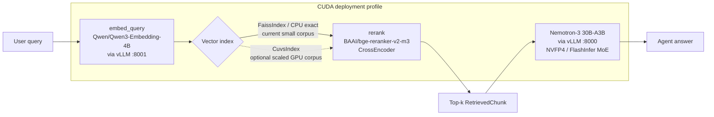

# Urban-Dossier v2 RAG

> **Optional subsystem.** RAG is not currently loaded by the production
> `urban-dossier` OpenClaw agent and is not required to run the map, FastAPI
> scoring, or dedicated Agent chat. Enable it only for the structured
> `/api/agent/ask`/retrieval track after starting the embedding service and
> building an index.

Retrieval-augmented context for the `urban_dossier_analyst` agent. The corpus is the
18 NYC Open Data datasets the project ships with; each dataset is decomposed into
3-5 chunks (overview / column groups / join graph / sample SQL) and indexed for
on-device semantic search.

This package is a clean break from the v1 hardcoded fallback. There is no legacy
6-pair lookup; every retrieval goes through the embedding pipeline.

## Architecture



Two vLLM service instances use the same container stack: Nemotron-3 30B on
`:8000` and optional Qwen3-Embedding-4B on `:8001`. On x86 they are declared in
`deploy/compose.gpu.yml`; on DGX Spark use the platform-specific deployment
instructions.

## Setup

The adapter supports both x86 CUDA and DGX Spark. The commands below assume the
main Nemotron vLLM service is already healthy. See `DEPLOY_WORKSTATION.md` or
`DEPLOY_DGX_SPARK.md` for the selected platform.

### 1. Start the embedding vLLM instance (Qwen3-Embedding-4B)

```bash
# Download the model once (skip if cached)
huggingface-cli download Qwen/Qwen3-Embedding-4B

# x86 workstation: start only the optional embeddings service.
docker compose \
  --env-file /mnt/data/urban-dossier-state/runtime/gpu.env \
  -f deploy/compose.gpu.yml up -d embeddings
```

Verify:

```bash
curl -s http://localhost:8001/v1/models | jq '.data[].id'
# Expect: "Qwen/Qwen3-Embedding-4B"
```

### 2. Install Python dependencies

```bash
cd Urban-Dossier
python -m venv .venv && source .venv/bin/activate
pip install -r rag/requirements.txt

# Optional only when a larger corpus benchmark justifies GPU indexing:
pip install cuvs-cu13            # try pip wheel first
# DGX may use the RAPIDS conda channel if its architecture lacks a pip wheel.
```

The first import of the reranker downloads `BAAI/bge-reranker-v2-m3` (~600 MB)
into `~/.cache/huggingface/hub/`.

## CLI usage

### Ingest

```bash
cd Urban-Dossier
PYTHONPATH=. python -m rag.ingest rag/catalog.json --index-dir rag/index
```

Outputs (filename depends on the active backend, decided at index build time):

- `rag/index/corpus.cuvs` + `corpus.cuvs.vectors.npy` + `corpus.cuvs.meta.json` — cuVS path
- `rag/index/corpus.faiss` + `corpus.faiss.meta.json` — FAISS-CPU fallback path

The selected backend is logged at INFO level (`VectorIndex backend: ...`).

### Query (from Python)

```python
from rag import retrieve

hits = retrieve(
    "weekend rodent complaints in Brooklyn",
    dataset_filter=["safety_311", "safety_rodent"],
    top_k=5,
)
for hit in hits:
    print(f"[{hit.score:.3f}] {hit.dataset_id} :: {hit.chunk_id}")
    print(hit.content[:160])
```

`dataset_filter=None` searches the whole 18-dataset corpus. Use the filter when
the planning step has already disambiguated which dataset the question targets.

### Tests

```bash
cd Urban-Dossier
PYTHONPATH=. python -m pytest rag/tests/ -q
```

The smoke tests stub the embedding HTTP layer via `unittest.mock`, so they pass
without a live embedding server.

## Integration with `urban_dossier_analyst`

The agent skill (in `Urban-Dossier/skills/urban_dossier_analyst/`) consumes the
public API:

```python
from rag import retrieve, RetrievedChunk

def plan_step(user_question: str, candidate_datasets: list[str]) -> str:
    chunks: list[RetrievedChunk] = retrieve(
        user_question,
        dataset_filter=candidate_datasets,
        top_k=5,
        rerank=True,
    )
    return "\n\n---\n".join(c.content for c in chunks)
```

Contract guarantees:

- Returns at most `top_k` results.
- Each result carries `dataset_id`, `chunk_id`, `score`, `content`, and full `metadata`.
- The `content` field is the raw chunk text, suitable for direct prompt injection.
- `score` is a comparable similarity (cosine after the vector index, reranker
  logit after rerank).

## Environment variables

| Variable | Default | Purpose |
| --- | --- | --- |
| `EMBEDDING_BASE_URL` | `http://localhost:8001/v1` | OpenAI-compatible base URL of the embedding vLLM instance |
| `EMBEDDING_MODEL` | `Qwen/Qwen3-Embedding-4B` | Model id served by the embedding vLLM instance |
| `EMBEDDING_API_KEY` | `not-needed` | API key (vLLM ignores) |
| `EMBEDDING_DIM` | `2560` | Vector dimension; override if you swap models (Qwen3-Embedding-0.6B = 1024, 8B = 4096) |
| `EMBEDDING_TIMEOUT` | `60` | Seconds per embedding HTTP call |
| `RERANKER_MODEL` | `BAAI/bge-reranker-v2-m3` | HF id for the cross-encoder |
| `RERANKER_DEVICE` | `cpu` | torch device for the reranker |
| `RAG_INDEX_DIR` | `./index` | Directory containing the vector index |
| `RAG_INDEX_FILENAME` | auto | `corpus.cuvs` if cuVS available, else `corpus.faiss` |
| `RAG_VECTOR_OVERSAMPLE` | `20` | Pre-rerank candidate count |
| `RAG_PREFER_GPU` | `1` | Allows cuVS when installed; set `0` for the current small CPU index |

## NVIDIA stack components called out for the judges

- **NVIDIA Blackwell** — target accelerator family; FP4 tensor cores accelerate the
  Nemotron NVFP4 weights and the Qwen embedding model on a single chip.
- **DGX 128 GB unified memory or workstation discrete VRAM** — provides room
  for model inference and optional future accelerated batch/index workloads;
  it does not change the shared Parquet dataset contract.
- **vLLM (single stack, two instances)** — `:8000` serves Nemotron-3 30B-A3B
  (NVFP4, FlashInfer MoE), `:8001` serves Qwen3-Embedding-4B. One inference
  engine, one set of NVIDIA optimizations.
- **NVIDIA cuVS** (`cuvs-cu13`) — optional GPU index adapter for a future
  substantially larger corpus. The current catalog is small enough that CPU
  exact/FAISS is valid on Mac, x86, and DGX Spark.
- **NVIDIA NemoClaw / OpenClaw** — sandbox runtime for the agent skill that
  consumes this RAG layer.
- **BAAI/bge-reranker-v2-m3** — open-source CrossEncoder reranker (Apache 2.0,
  no telemetry, runs on CPU or `cuda:0` per `RERANKER_DEVICE`).
